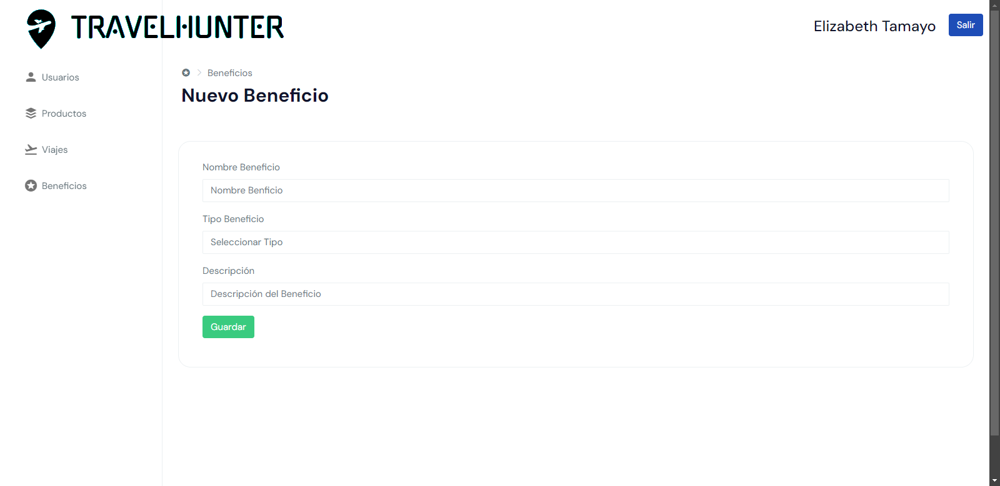

## Technologies used

## Web Design

# Web Prototype App

Web project developed for managing travel agencies and their clients. It is a prototype app developed to manage a DB with the data of the users, products, active travels and benefits offered by the agency.

 The web app implements these main modules:

- __Login__: screen to log in to the app with admin credentials.
  
  

- __Users Module__: manage user's data in the database.

	
  
  
---
- __Products Module__: manage products and all the associated data.

	
  
  
---
- __Travels Module__: manage the current active travels of the agency.
  
	
  
---
- __Benefits Module__: manage the benefits the agency offers to its clients.

	
  
  
---

All these modules manage their data through CRUD operations. 

There is also an API developed to send and update specific data through the mobile app developed alongside this project.

The mobile app is developed in Flutter and can be found in this [repository](https://github.com/ElyRiven/Prototipo-Movil-Proyecto)

## Database Schema

